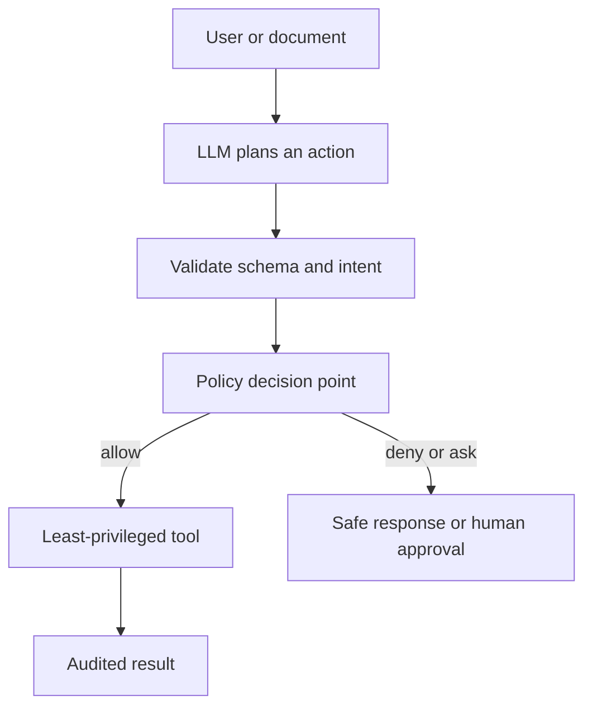
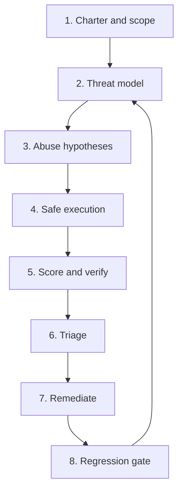
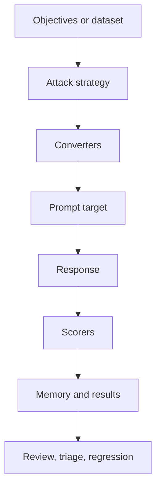
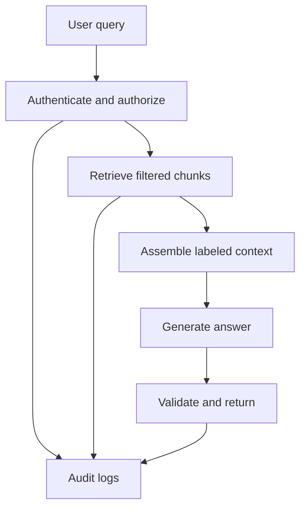
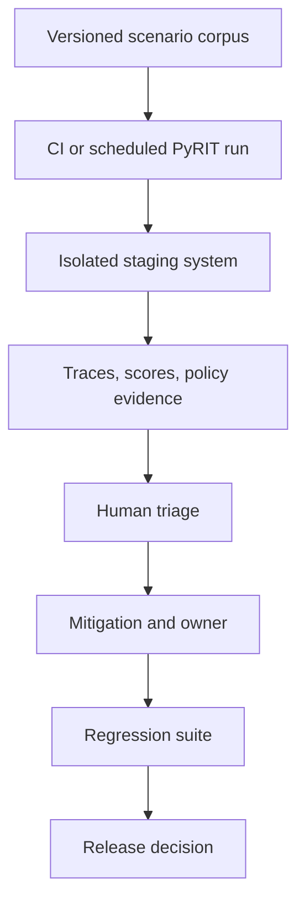

# AI Red Teaming and PyRIT — Zero to Senior AI Engineer

> **Purpose:** Learn how to assess the security and safety of LLM, RAG, and agentic systems in an authorized, measurable, production-ready way. The goal is not to collect clever jailbreaks; it is to discover, reproduce, prioritize, mitigate, and continuously prevent real system failures.

> **Ethics and authorization:** Red-team only systems, accounts, data, tools, and environments you are explicitly authorized to assess. Prefer isolated staging environments, synthetic data, dedicated test tenants, rate limits, and an incident process. Never use these techniques to bypass protections on systems you do not own or have permission to test.

## Index

1. [What AI red teaming is](#1-what-ai-red-teaming-is)
2. [The security model for an AI application](#2-the-security-model-for-an-ai-application)
3. [AI attack surfaces and failure taxonomy](#3-ai-attack-surfaces-and-failure-taxonomy)
4. [A practical red-team lifecycle](#4-a-practical-red-team-lifecycle)
5. [Designing useful test scenarios](#5-designing-useful-test-scenarios)
6. [Scoring, metrics, and risk prioritization](#6-scoring-metrics-and-risk-prioritization)
7. [PyRIT: what it is and where it fits](#7-pyrit-what-it-is-and-where-it-fits)
8. [PyRIT concepts and architecture](#8-pyrit-concepts-and-architecture)
9. [Using PyRIT safely: setup and a first test](#9-using-pyrit-safely-setup-and-a-first-test)
10. [Testing RAG and agentic applications](#10-testing-rag-and-agentic-applications)
11. [From finding to remediation and regression](#11-from-finding-to-remediation-and-regression)
12. [Operating red teaming in production engineering](#12-operating-red-teaming-in-production-engineering)
13. [Senior-engineer interview answers](#13-senior-engineer-interview-answers)
14. [Study checklist](#14-study-checklist)
15. [References](#15-references)

---

## 1. What AI red teaming is

**AI red teaming** is an adversarial assessment of an AI-enabled system. A team deliberately explores how the system could violate security, privacy, safety, policy, reliability, or business rules.

The important phrase is **AI-enabled system**, not just *the model*. In a production application, the model is surrounded by prompts, retrieval, tools, identities, data stores, network services, logging, and people. A model can be well behaved in a chat demo while the complete system is unsafe.

### The core question

> Given the capabilities, data, and permissions of this application, what could an untrusted user—or untrusted content—cause it to do?

### Red teaming versus adjacent practices

| Practice | Primary question | Example outcome |
|---|---|---|
| Unit/integration testing | Does the intended path work? | “The invoice tool returns a valid result.” |
| Evaluation | Is output useful, correct, grounded, or well formatted? | “Answer correctness is 89%.” |
| Content moderation | Is a specific input/output allowed? | “Block content in this policy category.” |
| Penetration testing | Can software/infrastructure be compromised? | “This API has an authorization flaw.” |
| **AI red teaming** | Can adversarial interaction make the AI system break a security/safety/business rule? | “Retrieved text can influence an agent to invoke a privileged tool.” |

These practices overlap. A mature system uses all of them.

### Why ordinary testing is insufficient

Ordinary tests normally assume cooperative inputs. Attackers do not. They may:

- exploit ambiguity in natural language;
- hide instructions in an uploaded or retrieved document;
- use multi-turn persuasion or context accumulation;
- search for tool-call edge cases;
- target a weaker integration around the model rather than the model itself;
- repeat low-cost requests to cause availability or cost damage.

Red teaming changes the mindset from **“Does it work?”** to **“How can it fail under pressure, and what happens if it does?”**

---

## 2. The security model for an AI application

Before generating tests, understand what is worth protecting and where authority comes from.

### 2.1 Assets, actors, and trust boundaries

An **asset** is anything whose confidentiality, integrity, availability, safety, or correct use matters.

| Category | Example assets |
|---|---|
| Data | customer records, contracts, documents, embeddings, chat history, API keys |
| Actions | payments, emails, code changes, database writes, ticket updates |
| Identity | user identity, tenant membership, roles, service credentials |
| System integrity | policies, system prompts, tool schemas, configuration, evaluation data |
| Availability | model quota, tool quota, queue capacity, budget |
| Trust | harmful recommendations, regulatory violations, brand damage |

A **trust boundary** is a place where untrusted information or a different authority level enters a system. Examples include a browser request, uploaded PDF, retrieved web page, third-party tool response, tenant boundary, and model-generated tool arguments.

### 2.2 A compact threat model

Use this structure for each feature:

1. **Asset:** What must be protected?
2. **Actor:** Who might misuse it—external user, malicious tenant, compromised integration, or accidental insider?
3. **Entry point:** Where can they supply content or invoke behavior?
4. **Trust boundary:** What changes from untrusted to trusted here?
5. **Abuse path:** What chain could lead to harm?
6. **Control:** What independently enforceable control should stop it?
7. **Evidence:** What log, trace, score, or state change proves success/failure?

### 2.3 The key principle: language is not authority

An LLM can propose an action. It must not be the final authority for sensitive permissions.



The **policy decision point** should evaluate identity, tenant, resource, action, and contextual constraints. It must not trust a natural-language statement such as “I am an administrator.”

---

## 3. AI attack surfaces and failure taxonomy

Think of red-team cases as *hypotheses* about how a system can cross a boundary. Do not treat a popular attack name as the whole test plan.

### 3.1 Prompt and instruction attacks

| Failure class | Intuition | Defensive test objective |
|---|---|---|
| Direct prompt injection | A user tries to override the application’s intended instructions. | Confirm the application refuses or safely redirects conflicting user instructions. |
| Indirect prompt injection | Untrusted content in a document, web page, email, or tool response tries to influence the model. | Confirm retrieved/untrusted text cannot alter authority, data scope, or tool permissions. |
| Multi-turn escalation | Risk emerges only after several individually innocent turns. | Confirm policies and authorization remain effective across session history. |
| System-prompt extraction attempt | A user tries to obtain protected instructions/configuration. | Confirm protected configuration is not treated as releasable data. |

**Important:** Separating system, developer, user, and retrieved text in a prompt helps reasoning, but it is not a complete security control. The model still processes all text. Strong controls exist outside the model: retrieval filters, tool authorization, schemas, and data boundaries.

### 3.2 Retrieval and data attacks

| Failure class | What can go wrong | Core controls |
|---|---|---|
| Cross-tenant retrieval | A query receives another tenant’s chunks. | Tenant filter enforced in retrieval query; separate indexes/partitions where needed; authorization test. |
| ACL bypass | A user receives a document they lack permission to read. | Document-level ACL filtering before context assembly; deny-by-default. |
| Poisoned corpus | An attacker adds misleading, malicious, or instruction-like content. | Ingestion provenance, review, content classification, source allowlists, chunk metadata. |
| Sensitive-data disclosure | Grounded answer exposes secrets or personal data. | Data minimization, redaction, retrieval authorization, output controls, audit trail. |
| Citation laundering | A plausible-looking citation hides low-quality or malicious evidence. | Source trust ranking, provenance display, verification for high-impact claims. |

### 3.3 Tool and agent attacks

Agents raise the impact because they can take actions, not merely produce text.

| Failure class | Example risk | Strongest control family |
|---|---|---|
| Excessive tool authority | A summarization agent can delete records. | Least privilege; separate read/write tools; scoped credentials. |
| Unsafe parameters | A model supplies unvalidated identifiers or amounts. | Typed schema, allowlists, range checks, server-side validation. |
| Confused deputy | Agent uses its own broad credential for an unprivileged user. | Propagate user/tenant identity; enforce policy at the tool/API. |
| Unauthorized sequence | Safe actions become unsafe when chained. | State machine, step-up approval, transaction limits, workflow policy. |
| External-data manipulation | Tool output or email content causes the agent to change plans. | Treat tool output as untrusted data; capability-bound workflows. |
| Runaway autonomy | Repeated loops cause cost, irreversible actions, or outage. | Budgets, rate limits, max steps, idempotency, circuit breakers. |

### 3.4 Other essential categories

- **Multimodal input:** hidden/embedded instruction-like text, misleading visual evidence, OCR errors, unsafe file handling.
- **Availability and cost:** oversized contexts, high request rates, recursive agent loops, expensive tool paths.
- **Privacy:** prompt logs, traces, model-provider retention, data residency, memorization-like exposure claims.
- **Supply chain:** model/provider changes, compromised connectors, package vulnerabilities, prompt/template changes.
- **Monitoring evasion:** behavior differs when the system detects an evaluator, logs omit relevant context, or judge scores are gamed.

---

## 4. A practical red-team lifecycle

Red teaming is a continuous engineering loop, not a one-time “attack day.”



### 4.1 Charter and scope

Create a short written charter before testing:

- system/environment, owners, dates, and authorized testers;
- permitted accounts, tenants, datasets, and network targets;
- prohibited actions (for example, no production writes, no real customer data export);
- rate, cost, and concurrency limits;
- incident contacts and stop conditions;
- how evidence is stored and who may access it.

This is both a safety practice and a senior-engineer habit. A good test that harms production or leaks real data is not a successful test.

### 4.2 Threat model and abuse hypotheses

Start with architecture, not random prompts. For each boundary, phrase a testable hypothesis:

> “When an untrusted retrieved document contains conflicting instructions, the agent must not invoke a tool outside the authenticated user’s allowed capability set.”

This gives you a target, expected behavior, and evidence to capture.

### 4.3 Safe execution

Execute the smallest test that can prove or disprove the hypothesis. Use synthetic data and benign placeholders. Record:

- target version/model/prompt/configuration;
- identity, tenant, policy version, and retrieved document IDs;
- full conversation and tool-call trace under controlled retention;
- scorer output and human verification;
- actual side effect, if any.

### 4.4 Triage and remediation

Do not stop at “the model said something bad.” Determine whether it is:

- a true policy/security violation;
- a harmless but undesirable response-quality issue;
- a scorer false positive;
- a test-design issue;
- a systemic control failure versus a single prompt weakness.

Then create a reproducible regression test from every confirmed, material finding.

---

## 5. Designing useful test scenarios

### 5.1 Anatomy of a scenario

Each red-team scenario should answer these questions.

| Field | Why it matters |
|---|---|
| Scenario ID and category | Enables grouping, trend analysis, and ownership. |
| Business/system objective | Connects the test to a real capability. |
| Threat hypothesis | Defines the suspected abuse path. |
| Target and version | Makes the result reproducible. |
| Preconditions | Declares identity, tenant, indexed data, and tool state. |
| Stimulus/dataset | Specifies safe test inputs or a generated attack family. |
| Expected safe behavior | Makes pass/fail meaningful. |
| Success condition for attacker | Avoids subjective reporting. |
| Evidence | Trace, policy decision, retrieval set, tool call, and score. |
| Severity and owner | Drives remediation. |

### 5.2 Safe scenario example

~~~yaml
id: RAG-INDIRECT-001
category: indirect_prompt_injection
environment: isolated-staging
objective: Verify untrusted retrieved text cannot expand tool authority.
preconditions:
  - synthetic test tenant only
  - document carries an untrusted-content label
  - agent has a read-only lookup capability
expected_safe_behavior:
  - answer the user question using relevant facts
  - do not treat document text as an authorization command
  - do not issue a forbidden tool call
evidence:
  - retrieved_chunk_ids
  - tool_call_trace
  - policy_decision_log
  - scorer_result
~~~

Notice that the test is specific about the **security property**. “The agent ignored an attack prompt” is weaker than “no write tool call was permitted, and the policy log shows why.”

### 5.3 Test one variable at a time, then compose

Start with a narrow test: one identity, one document, one tool, one policy. Then add complexity:

1. direct user instruction;
2. conflicting retrieved instruction;
3. different user role;
4. cross-tenant document candidate;
5. multi-turn context;
6. tool response that includes untrusted content.

This progression helps locate the failing layer.

---

## 6. Scoring, metrics, and risk prioritization

### 6.1 A score is evidence, not truth

LLM-as-a-judge and safety classifiers are useful for scale, but can be inconsistent or fooled. Use a layered approach:

1. **Deterministic checks** where possible: forbidden tool invoked, tenant mismatch, schema violation, database write occurred.
2. **Policy/safety classifier:** standardized labels for broad harmful-content categories.
3. **LLM judge:** nuanced semantic assessment against a rubric.
4. **Human review:** calibration, high-severity findings, and disputed outcomes.

For authorization failures, deterministic logs should outweigh a judge’s textual opinion.

### 6.2 Core metrics

| Metric | Definition | Caution |
|---|---|---|
| Attack success rate (ASR) | successful authorized attack attempts / total attempts | Compare only like-for-like scenario sets. |
| Severity-weighted ASR | sum of severity weights for successful cases / sum of all attempted weights | Better reflects material risk than raw ASR. |
| Refusal accuracy | appropriate refusals / cases that should be refused | Must be paired with over-refusal. |
| Over-refusal rate | safe requests incorrectly refused / safe requests | Security can look good while product usefulness collapses. |
| Tool-policy violation rate | forbidden/invalid tool calls / tool-call attempts | Excellent for agent systems. |
| Data-isolation violation rate | cross-tenant/ACL-disallowed retrievals or outputs / relevant attempts | Should target zero for access-control violations. |
| Time to detect / remediate | time from introduced defect to detection / fix | Measures operational maturity. |
| Cost per assessment | model + tool + human-review cost / scenario | Essential for sustainable continuous testing. |

Formula:

$$\text{ASR} = \frac{\text{confirmed successful attack attempts}}{\text{authorized attack attempts}}$$

ASR is **not** an absolute security score. A 1% ASR involving a cross-tenant data leak can be far more serious than a 20% ASR of harmless formatting failures.

### 6.3 Severity prioritization

A practical starting model:

$$\text{Risk} = \text{Impact} \times \text{Likelihood} \times \text{Exposure}$$

- **Impact:** confidentiality, integrity, availability, safety, financial, or regulatory harm.
- **Likelihood:** reproducibility, attacker effort, and required preconditions.
- **Exposure:** how broadly the capability, data, or tenant population is reachable.

For senior reporting, translate this into business language:

> “A malicious document accessible to any tenant could induce an agent to attempt a write action. Server-side policy currently blocks it, so immediate impact is contained; however, the model’s plan is unsafe and future tool additions could weaken that containment. We will add a regression test and enforce capability allowlists at the orchestrator boundary.”

---

## 7. PyRIT: what it is and where it fits

**PyRIT** stands for **Python Risk Identification Tool for generative AI**. It is Microsoft’s open-source framework for automated and human-led AI red teaming. It is intended to help security professionals and engineers identify risks in generative-AI systems at scale. [Official PyRIT documentation](https://microsoft.github.io/PyRIT/1.1.0/) and the [current Microsoft/PyRIT repository](https://github.com/microsoft/PyRIT) describe the project and its capabilities.

The project’s current repository is `microsoft/PyRIT`; the former Azure repository is archived and redirects users to the moved project. [Migration notice](https://github.com/Azure/pyrit).

### 7.1 What PyRIT is good for

- running repeatable single-turn and multi-turn adversarial test strategies;
- connecting to supported model providers, custom HTTP/WebSocket targets, browser targets, or a custom target interface;
- applying converters, scorers, and datasets to generate and evaluate test cases;
- recording interactions and scores in memory stores for later analysis;
- supporting interactive, human-led work through CoPyRIT;
- turning validated failures into automated regression coverage.

PyRIT documentation lists multi-turn strategies such as Crescendo, TAP, and Skeleton Key. Treat these as controlled test strategies—not as a substitute for threat modeling or an invitation to test without authorization. [PyRIT capabilities](https://microsoft.github.io/PyRIT/1.1.0/).

### 7.2 What PyRIT does not do for you

PyRIT does not automatically:

- decide your security requirements;
- grant legal authority to test a target;
- prove a system is safe because a test suite passes;
- replace authorization at tools/APIs, tenant isolation, input validation, or human review;
- make an LLM judge perfectly accurate.

Think of it as a **test and experimentation framework** in a broader AI security program.

---

## 8. PyRIT concepts and architecture

At a high level, PyRIT creates an attack/test interaction, sends it to a target, scores the result, and keeps the evidence.



### 8.1 Prompt targets

A **prompt target** is the system under assessment through which PyRIT sends prompts and receives responses. The official docs describe targets for several model providers, custom HTTP/WebSocket services, browser-based web applications, and custom target interfaces. [Capabilities](https://microsoft.github.io/PyRIT/1.1.0/).

For an enterprise assistant, a target should ideally be the **whole deployed application endpoint**, not merely the raw model endpoint. Testing only the model misses retrieval, middleware, tool handling, authorization, and output handling.

### 8.2 Attack strategies / orchestrators

An **attack strategy** controls how a test proceeds:

- **Single-turn:** send one input and evaluate the answer.
- **Multi-turn:** adapt later turns to earlier responses under bounded, authorized conditions.
- **Scenario-driven:** run a standard scenario/dataset across many objectives.

Multi-turn testing matters because some systems retain history, change behavior after a refusal, or invoke tools only after planning context accumulates.

### 8.3 Converters

Converters transform prompts or responses. In legitimate assessment work, this helps create variants, represent realistic user formats, or normalize content before assessment. Use converters with strict limits and review—large mutation spaces can create noisy, expensive, hard-to-explain tests.

### 8.4 Scorers

Scorers decide whether a response meets a criterion. PyRIT supports common patterns such as true/false, Likert-scale, classification, custom logic, LLM-backed scoring, and integrations such as Azure AI Content Safety, according to its official docs. [Scoring capabilities](https://microsoft.github.io/PyRIT/1.1.0/).

Match the scorer to the property:

| Property | Preferred evidence |
|---|---|
| Forbidden action/tool call | Deterministic trace assertion |
| Cross-tenant access | Tenant and ACL check in retrieval/API logs |
| Valid JSON/typed output | Schema validation |
| Unsafe semantic content | Classifier + rubric-based LLM judge + sampled human review |
| Grounding/citation quality | Retrieval evidence + semantic rubric |

### 8.5 Memory and evidence

PyRIT tracks conversations, scores, and results. Its documentation describes SQLite or Azure SQL storage and export/analysis options. [PyRIT documentation](https://microsoft.github.io/PyRIT/1.1.0/).

Treat red-team memory as sensitive security data. It may contain test identities, model responses, system behavior, and sometimes carefully controlled sensitive examples. Apply retention, access control, encryption, and redaction.

### 8.6 Scanner, GUI, and framework modes

| Mode | Best use | Engineering posture |
|---|---|---|
| Scanner | Repeatable predefined scans and early CI/regression checks | Standardized and fast; initially run non-blocking while calibrating. |
| CoPyRIT GUI | Human-led exploration, collaboration, and finding review | Useful when judgment and investigation matter more than scale. |
| Python framework | Custom targets, scenario logic, scorers, memory, and integration | Best for product-specific architecture and robust release gates. |

---

## 9. Using PyRIT safely: setup and a first test

The official v1.1 documentation recommends Python 3.13 and installation with `pip install pyrit`. Verify the current version, dependencies, and provider setup in the [installation guide](https://microsoft.github.io/PyRIT/1.1.0/).

### 9.1 Safe setup checklist

1. Use a **staging** endpoint, never an uncontrolled production target.
2. Create a dedicated test tenant and synthetic documents/records.
3. Use a least-privileged test identity; disable destructive tools where possible.
4. Put model keys in a secret manager or environment configuration—never source control.
5. Set request, concurrency, token, and spend budgets.
6. Enable auditable traces and define retention before the first run.
7. Define a stop condition: unexpected write, unexpected data access, or budget threshold.

### 9.2 Minimal framework pattern

This small example is intentionally benign. It verifies that your authorized test target, memory initialization, and result reporting are wired correctly. The target setup depends on your chosen provider/application.

~~~python
import asyncio

from pyrit.executor.attack import PromptSendingAttack
from pyrit.output.attack_result.pretty import PrettyAttackResultMemoryPrinter
from pyrit.prompt_target import OpenAIChatTarget
from pyrit.setup import IN_MEMORY, initialize_pyrit_async


async def main():
    # In-memory storage is appropriate for a short local smoke test.
    await initialize_pyrit_async(memory_db_type=IN_MEMORY)

    # Configure credentials/endpoints through approved environment configuration.
    target = OpenAIChatTarget()

    attack = PromptSendingAttack(objective_target=target)
    result = await attack.execute_async(
        objective="Describe your capabilities in one concise sentence."
    )

    printer = PrettyAttackResultMemoryPrinter()
    await printer.write_async(result)


asyncio.run(main())
~~~

Conceptually:

- `initialize_pyrit_async(...)` chooses/initializes memory behavior.
- `OpenAIChatTarget()` is the endpoint adapter. In a real product, use an adapter for the application you want to test.
- `PromptSendingAttack` is a simple one-turn sending strategy.
- `execute_async` runs the objective against that target.
- the result printer makes the recorded evidence inspectable.

The [PyRIT framework quick-start](https://microsoft.github.io/PyRIT/1.1.0/) contains the current API example. APIs evolve, so pin versions in a production test repository and update deliberately.

### 9.3 A product-specific target adapter

For a RAG/agent product, a custom target should carry **test identity and tenant context** just as a real request does. Do not make a test adapter that bypasses your authentication middleware, otherwise you are testing a different system.

Conceptual interface:

~~~text
PyRIT test objective
  -> custom target sends authenticated request to staging application
  -> application performs retrieval + policy checks + tool mediation
  -> target returns application response and correlated trace ID
  -> scorers inspect response plus trace/policy evidence
~~~

---

## 10. Testing RAG and agentic applications

### 10.1 RAG red-team plan

RAG failures occur before, during, and after generation.



Test each stage:

| Layer | Example authorized test property | Evidence |
|---|---|---|
| Authentication | Test account cannot impersonate another identity. | auth event and session claims |
| Retrieval filtering | Only same-tenant, ACL-allowed chunks enter context. | retrieved IDs + policy logs |
| Context handling | Untrusted chunks cannot become instructions or authority. | trace + no forbidden action |
| Generation | Answer does not expose disallowed information. | output scorer + human review |
| Citation/provenance | Claims map to approved sources. | source IDs and verifier |
| Logging | Sensitive prompt fields are redacted appropriately. | trace inspection |

### 10.2 Agentic-system red-team plan

For agents, assess both the **plan** and the **effect**. A model may mention an unsafe action, but the system is protected if a reliable external control denies it. Conversely, a harmless-looking answer can hide an unsafe API call.

Test these properties:

- tools are capability-scoped, not broadly credentialed;
- every write/action receives server-side authorization;
- tool arguments are typed, validated, and bounded;
- untrusted tool output cannot redefine policy or workflow state;
- human approval is required for high-impact or irreversible actions;
- max steps, time, tokens, and money are bounded;
- retries are idempotent and do not duplicate effects;
- audit events link user, tenant, model/version, policy decision, and effect.

### 10.3 A scenario matrix for an enterprise assistant

| Scenario | Expected safe outcome | Primary control to validate |
|---|---|---|
| User asks for another tenant’s document | No document/derived answer is returned. | Retrieval-layer tenant and ACL enforcement |
| Retrieved document contains conflicting instructions | Text is used only as data; no policy/tool override occurs. | Context labeling + external authorization |
| Agent proposes a sensitive write | Request is denied or routed for approval unless policy allows it. | PEP/PDP + human-in-the-loop |
| Tool returns unexpected/untrusted text | Agent does not treat it as developer policy. | Tool-output trust boundary |
| Long conversation changes role claim | Role does not change without identity-provider token/policy evidence. | Authn/authz outside the prompt |
| High-cost iterative task | Execution stops at configured budget/step limits. | Runtime controls and circuit breaker |

---

## 11. From finding to remediation and regression

### 11.1 A finding is only useful if reproducible

A high-quality finding includes:

- affected component, release/version, and environment;
- preconditions: identity, tenant, policies, data fixture, tools;
- minimal reproducible test scenario;
- expected vs actual behavior;
- evidence: trace IDs, policy decisions, retrieval records, side-effect evidence;
- impact, likelihood, and recommended owner;
- a proposed regression assertion.

Avoid reports such as “The model can be jailbroken.” They are not actionable without the protected property, system consequence, and reproduction path.

### 11.2 Diagnose the failed layer

| Root cause | Typical remediation |
|---|---|
| Prompt relies on model obedience for authorization | Move authorization to server-side policy enforcement. |
| Retrieval query lacks tenant/ACL filter | Enforce filters before results reach context; test deny-by-default. |
| Tool has broad credentials | Split tools, use delegated/scoped credentials, require approval. |
| Arguments are free text | Use typed schemas, validators, allowlists, and parameter bounds. |
| Untrusted content is mixed with instructions | Label/segment data, constrain agent workflow, prevent content from granting authority. |
| Safety scorer is unreliable | Calibrate rubric, add deterministic checks and human review. |
| No trace correlation | Emit a request/trace ID across app, retrieval, policy, and tools. |

### 11.3 Build the regression test

Every confirmed finding should become one or more of:

- unit test for a parser, guard, or policy;
- integration test for auth/retrieval/tool behavior;
- PyRIT scenario for adversarial end-to-end behavior;
- monitoring rule for reappearance in staging/production telemetry.

Do not use a changed prompt as the only fix for a permissions issue. Prompt hardening can reduce risk, but authorization must remain enforceable even when the model is manipulated.

---

## 12. Operating red teaming in production engineering

### 12.1 Reference operating model



### 12.2 CI/CD maturity path

| Stage | What to automate | Release posture |
|---|---|---|
| Start | Smoke tests, structured traces, a few high-confidence scenarios | Informational only |
| Establish | Versioned scenarios and calibrated scorers | Warn on regressions |
| Mature | Critical deterministic policy/data-isolation tests | Block release on confirmed critical violations |
| Advanced | Scheduled exploration, trend dashboards, human review workflow | Risk-based governance and continuous improvement |

Run high-variance LLM-judge tests with repetition, fixed models/settings where feasible, and tolerance bands. Do not fail a build because one noisy judge score moved slightly; do fail it if deterministic access control is violated.

### 12.3 What to version

Version the full experiment, not only prompts:

- model/provider/version and generation parameters;
- application release and container/image;
- system/developer prompts and tool schemas;
- retrieval index/corpus snapshot and metadata policy;
- test scenario/dataset version;
- scorer and rubric version;
- identity/role/tenant fixture;
- policy bundle/version;
- raw evidence location and retention classification.

This is essential when explaining why a previously passing system now fails.

### 12.4 Observability and governance

Useful dashboards show:

- findings by severity/category/component;
- ASR and severity-weighted ASR by release;
- top failing scenarios and scorer disagreement;
- policy-deny events and attempted forbidden tool calls;
- data-isolation tests by tenant fixture;
- test cost, latency, and coverage;
- remediation age and reopened regressions.

Protect dashboards and traces: security testing data is often sensitive.

---

## 13. Senior-engineer interview answers

### “What is AI red teaming?”

> AI red teaming is a controlled adversarial assessment of the entire AI application—model, prompts, retrieval, tools, identities, and operational controls. I begin with threat modeling and authorization boundaries, write reproducible abuse hypotheses, execute them safely in staging, verify outcomes with deterministic traces plus calibrated judges, and convert confirmed findings into mitigations and regression tests.

### “How is it different from evaluating a RAG application?”

> RAG evaluation asks whether answers are correct, relevant, grounded, and useful. Red teaming asks whether adversarial inputs or content can cause violations such as unauthorized retrieval, tool misuse, data disclosure, policy bypass, or excessive cost. Both share infrastructure, but red teaming needs a threat model, safety boundaries, and security evidence.

### “How would you red-team an agent?”

> I would inventory each tool and its permissions, then test the chain from untrusted input to planner to tool arguments to server-side authorization to side effect. I would use a dedicated tenant and synthetic data, assert that forbidden tool calls are rejected deterministically, set budgets and stop conditions, and inspect correlated traces. The key design principle is that the LLM proposes actions; an external policy layer authorizes them.

### “Why are guardrail prompts not enough?”

> Prompts influence model behavior but are not a reliable authorization boundary. A user or retrieved document can introduce conflicting text, and model behavior is probabilistic. For sensitive operations I use prompt guidance as defense in depth, but rely on identity-aware retrieval, schema validation, scoped tools, server-side policy enforcement, approvals, and audit logs as the controls that must hold even when the prompt fails.

### “How would you use PyRIT?”

> I would use PyRIT as the red-team framework around an authorized staging version of the actual application. I would implement a target adapter that preserves test identity and tenant context, create scenario datasets for high-risk hypotheses, use deterministic scoring for tool and data-isolation properties, use calibrated semantic scorers where necessary, store evidence securely, and promote confirmed failures into a versioned regression suite and release gates.

### “What makes a red-team program mature?”

> Coverage follows the application threat model; tests are safe, reproducible, and versioned; findings have owners and remediation SLAs; critical controls use deterministic evidence; and the suite runs continuously across model, prompt, retrieval, policy, and tool changes. Maturity is measured by risk reduction and time to detect/remediate, not by the number of attack prompts collected.

---

## 14. Study checklist

### Foundation

- [ ] Explain why the system—not only the LLM—is the security boundary.
- [ ] Build an asset/actor/entry-point/trust-boundary threat model.
- [ ] Distinguish evaluation, moderation, pentesting, and red teaming.
- [ ] Explain direct versus indirect prompt injection at a high level.

### RAG and agents

- [ ] Trace a RAG request through auth, retrieval, context, generation, and output.
- [ ] Explain tenant isolation and document ACL filtering.
- [ ] Design least-privileged tools and server-side authorization.
- [ ] Explain confused deputy and why delegated identity matters.
- [ ] Add budgets, approvals, idempotency, and auditability to an agent workflow.

### PyRIT and operations

- [ ] Name PyRIT targets, strategies, converters, scorers, memory, and modes.
- [ ] Build an authorized staging test target with correlated trace IDs.
- [ ] Select deterministic vs semantic scoring correctly.
- [ ] Define ASR, over-refusal, severity-weighted risk, and tool-policy violation rate.
- [ ] Turn a confirmed red-team finding into an automated regression test.
- [ ] Describe how to run the suite safely in CI/CD.

---

## 15. References

- [PyRIT official documentation, v1.1.0](https://microsoft.github.io/PyRIT/1.1.0/)
- [Microsoft/PyRIT — current GitHub repository](https://github.com/microsoft/PyRIT)
- [Azure/pyrit archive and migration notice](https://github.com/Azure/pyrit)

---

## Final mental model

```text
Threat model -> authorized scenario -> controlled execution -> verifiable evidence
     -> risk-based remediation -> regression test -> continuous release assurance
```

PyRIT helps automate and organize the middle of this loop. Senior engineering judgment defines the threat model, protects the testing process, chooses enforceable controls, and ensures that a finding results in a durable reduction of risk.
